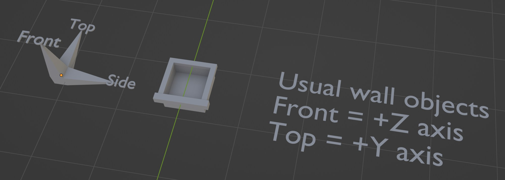
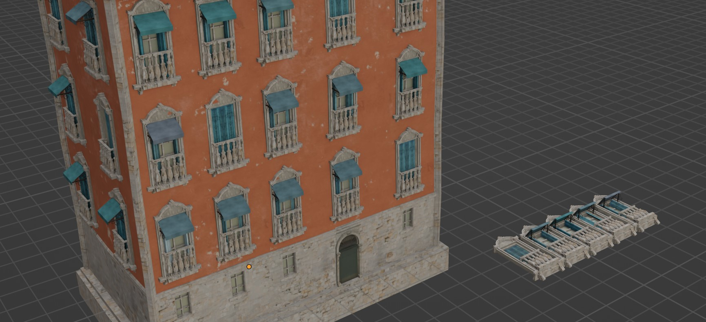
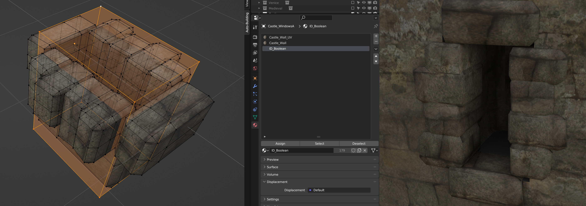

Building parts
------------

The parts used by the system need to be oriented in a specific way in order to work properly. 

Most of the time you can assume than the top of your objects (Windows, Doors, etc) will oriented toward the positive Y axis, and the front toward the positive Z axis.
Similar than the Asset browser orientation system, the Z axis will be used perpendicularly to the surface the object is used on.

All the parts you will be making need to be put in their own collections. If you put multiple objects in the same collection, the system will pick them randomly in it.

Some objects such as for the Roof or Support will have their orientation a bit difference.

If you're not sure, a text is added next to the Example Objects and an Orientation Checker object is here for you to test it.

Here is the list of the directions.

.. image:: images/Orientation.jpg

Booleans
--------

If you want your objects to create a hole in the face (for windows for instance) You'll need to model an extra shape (like a box) combined with your object, and apply the ID_Boolean on it. 
This shape will be used to boolean a hole in the wall and won't be rendered.
