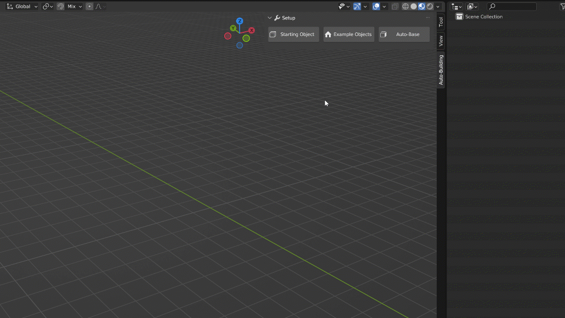
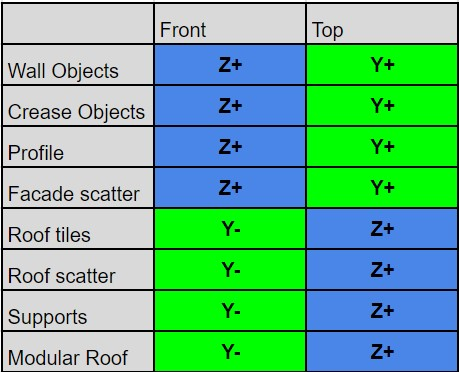

Start
========

.. _Setup:

Start Object
------------

If you want to create your own building style from scratch, it's a very easy process!
With the addon enabled, simple click on either **Starting Object** or **Example Object** to begin.

The **Starting object** will create a simple cube and add the Auto-Building modifier on it as well as all the necessary Materials.

The **Example object** will be a bit more complexe. I will comes already setup with simple geometries for you to have a quick start in the modeling process.

.. image:: images/ImportExample.gif

You can also start the process by grabbing a preset model from the Asset Browser. You can then manually transfer the geometry node modifier and ID materials to the object you want to work on. Or modify the asset you just imported to your own taste.

Parts Modeling
------------

The parts used by the system need to be oriented in a specific way in order to work properly. 

Most of the time you can assume than the top of your objects (Windows, Doors, etc) will oriented toward the positive Y axis, and the front toward the positive Z axis.
Similar than the Asset browser orientation system, the Z axis will be used perpendicularly to the surface the object is used on.

//insert orientation image//

All the parts you will be making need to be put in their own collections. If you put multiple objects in the same collection, the system will pick them randomly in it.

//insert random windows on facade

Some objects such as for the Roof or Support will have their orientation a bit difference.

If you're not sure, a text is added next to the Example Objects and an Orientation Checker object is here for you to test it.

//insert example object text//

Here is the list of the directions.

.. autosummary::
   :toctree: generated

   lumache
