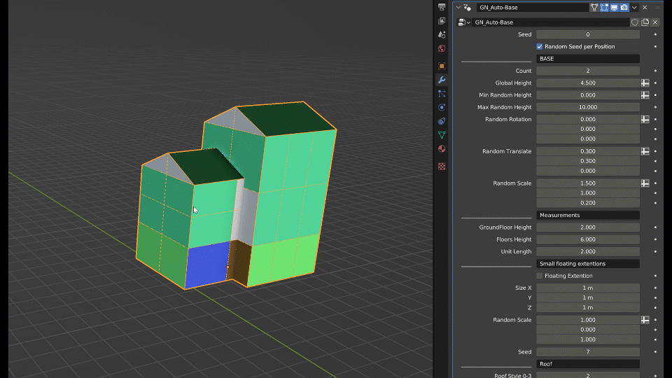
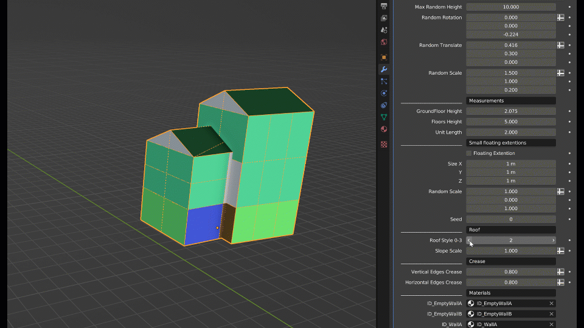

Auto-Base
=========

.. image:: images/AutoBaseVariations.gif

The Auto-Base Geometry Node is a tool to use along the Auto-Building. It will help you generate a base for your buildings. It won't be as good as a manual modelling but it can help you create simple variations or have a starting point.

There is no custom interface for that but the setting are not that many and are (I think) simple enough. But here are some gid to see what you can do:

.. image:: images/AutoBaseTransform.gif

.. image:: images/AutoBaseSettings.gif

