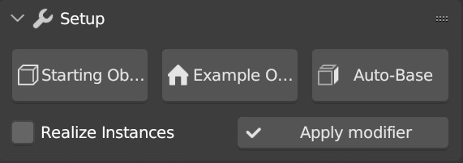
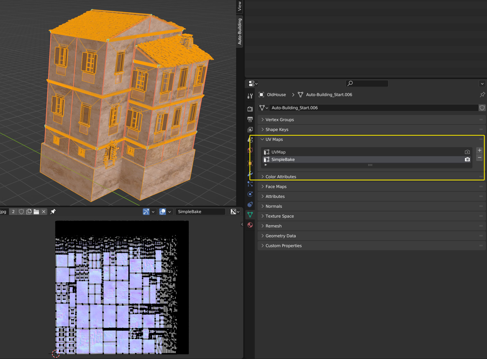
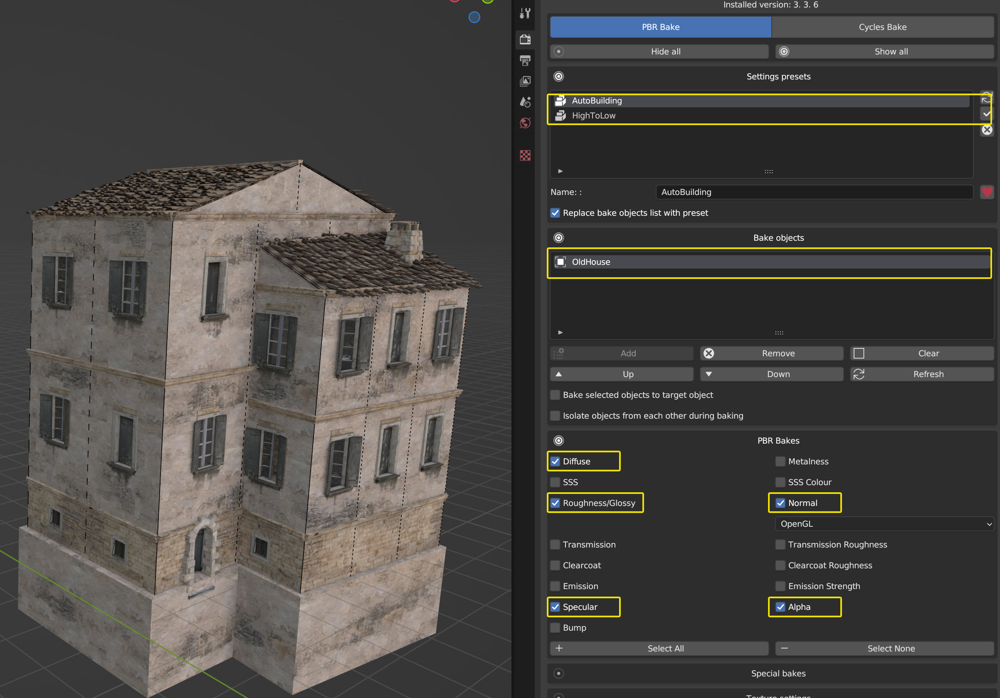
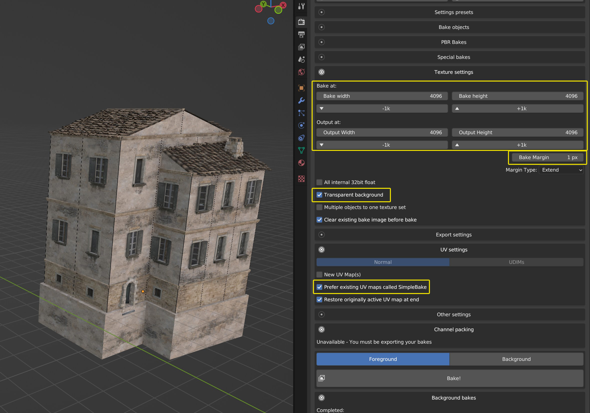
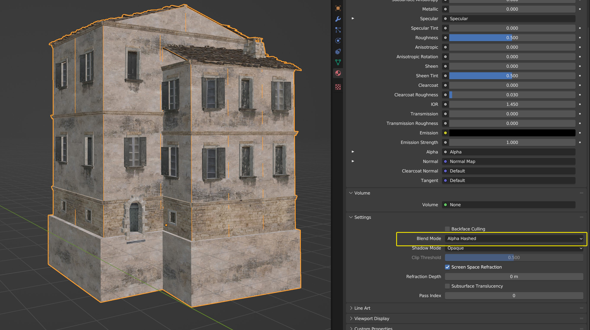
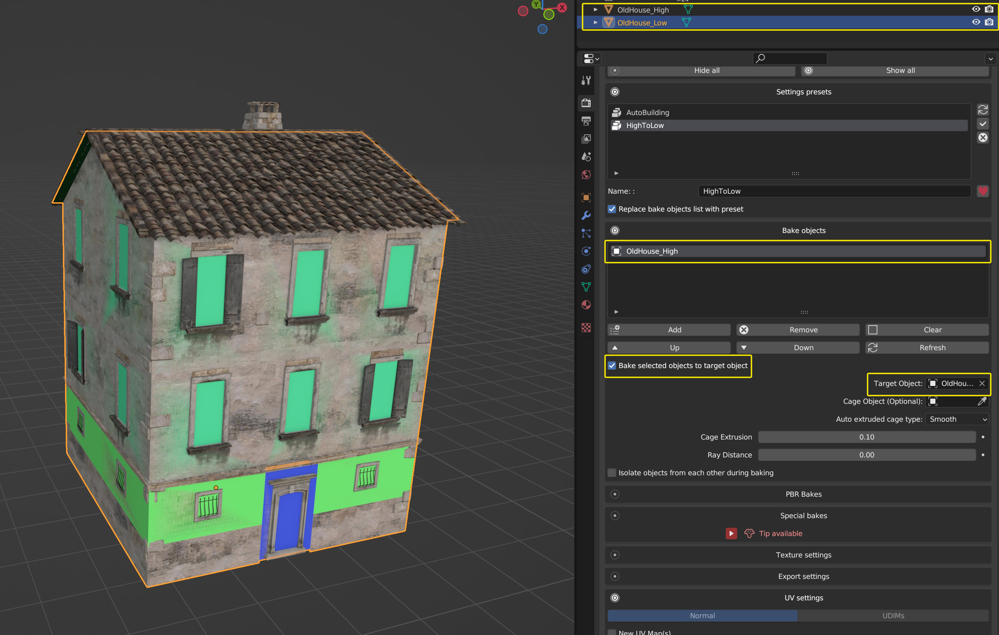
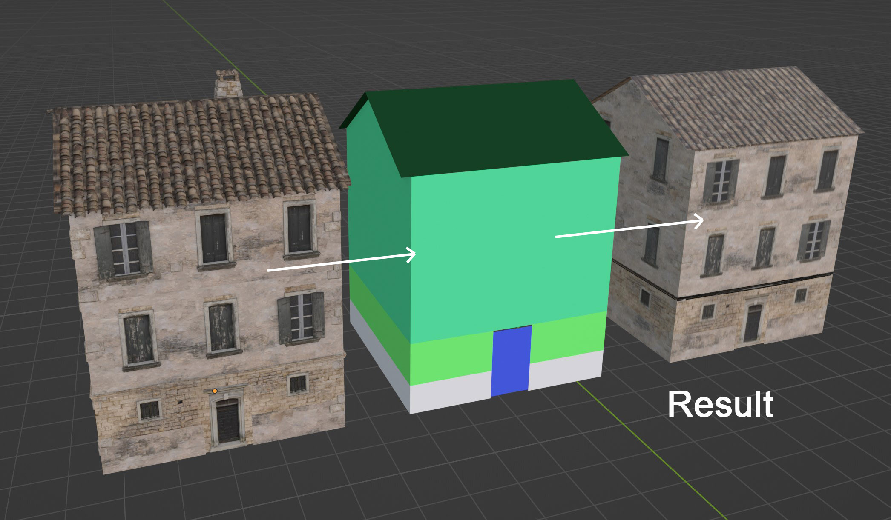

Export
======

If you want to apply the auto-Building modifier. You'll need to check the **Realize Instances** button before clicking **Apply Modifier**.

In order to export the building outside of blender, it could be interesting to bake the texture on the original mesh or on the low poly version (the one you have if you turn off the Geometry Node)
Here are my settings using the Simple Bake Addon, but I'm sure it's also doable without it:

1) Apply the Geometry node, create a new UV Map called SimpleBake, and Unwrap your model how you want (here I just used the Smart UV Project method)

2) Create yourself a Preset for easier re-use (I also have one to bake the high poly on the low poly)

Add your object in the Bake objects list.
Select the textures you'll need in the PBR Bakes list 

3) Here I'll be baking 4k maps. You'll need to turn on Transparent background because this specific building has transparency in the decals materials.

Make sue to have the **Prefer existing UV maps called SimpleBake**
In the **Other Settings** tab (not opened in the screenshot), you can turn on the **Copy objects and apply bakes** to get your result as a copy.

4) Run the baking process byt clicking **Bake!**

Here the decals transparency is not properly dealt with in eevee so I change the Blend Mode of the baked materials to Alpha Hashes to fix it.

5) You can bake the High Poly to the Low Poly. You can also play settings to get a better result: **Auto extruded cage type** and **Cage Extrusion**

