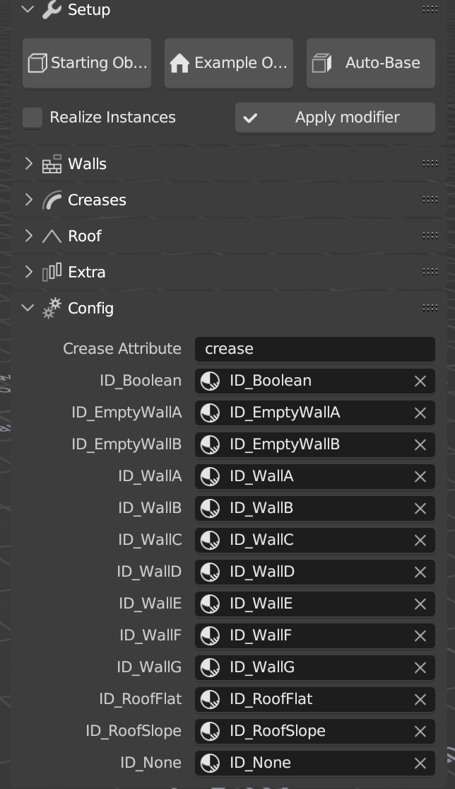

Config
-----------------

Normally you won't need to touch this menu. But it's useful to keep an eye on it if something doesn't work properly. 
The most comon problem is to have duplicated materials in the scene. With the tool looking for the wrong ones (ie: ID_Boolean.001)

Please make sure that the materials assigned to the building and the Boolean material on the parts are the same one you can find in this menu.

