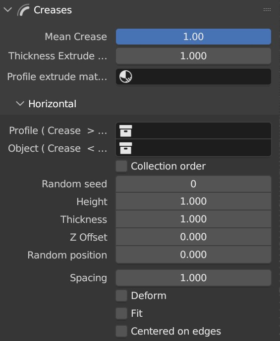
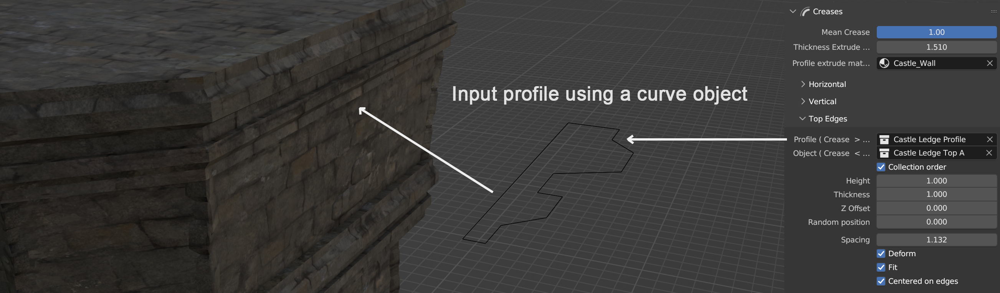

Creases
===========

.. image:: images/CreaseSetup.gif

Change the **Crease** of your edges to either spawn objects on it or extrude it to create ledges and details.

**The Update 1.2 adds an extra option for the Crease. The switch between both, A and B, you have to set the Crease value as this**

.. image:: images/Crease1.2.jpg

``Mean Crease``

  Quickly change the crease value of the selected edges. For each edges, if the Crease attribute is above 0, it will spawn either objects on it or extrude it following a provided profile.

.. image:: images/CreaseSelection.gif

``Thickness Multiplier``

  Edit the size of all extruded Creases all together.

.. image:: images/CreaseMultiplier.gif

``Profile extrude material``

  Material to use on the extrude edges.

All the different creases (horizontal, vertical, or top edges) use almost the same options.
The Top Edges is used when the crease if on the toppest edge of the face. Allowing to scatter different kind of object around the top of your building. Under the roof for instance.

``Profile``

  Collection containing the profile to use for the extrude. If Crease > 0.5.

``Object``

  Collection containing the objects to spawn along the edges. If Crease < 0.5.

``Collection order``

  Will randomly pick objects from the collection or pick them in order.

.. image:: images/CreaseOrder.gif

``Height``

  Change the length or height of the objects.

.. image:: images/CreaseHeight.gif

``Thickness``

  Change the size of the objects.

.. image:: images/CreaseThickness.gif

``Z Offset``

  Move the objects vertically.

.. image:: images/CreaseZOffset.gif

``Random position``

  Move the object randomly.

.. image:: images/CreaseRandomPosition.gif

``Spacing``

  Control the distance between the objects.

.. image:: images/CreaseSpacing.gif

``Deform``

  The objects will be deformed to follow the curvature and avoid having gap when reaching corners of the building.

.. image:: images/CreaseDeform.gif

``Fit``

  Will scale the objects to avoid any gaps inbetween them. Here is an example with and without the deform option.

.. image:: images/CreaseFit.gif
.. image:: images/CreaseDeformFit.gif

``Center on edges``

  Will spawn an object at the center of each edges. If the option Fit is On, they will be scaled to fit the edge size.

.. image:: images/CreaseCentered.gif
