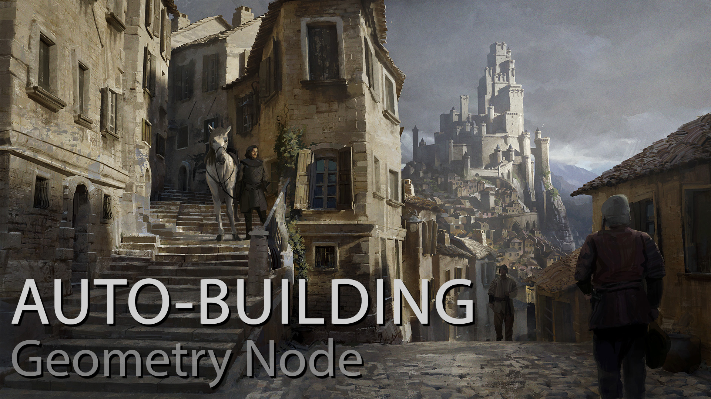

Welcome to the Auto-Building's documentation!
===================================

.. note::
**This addon is for Blender 3.5+ only!**

The system is only using Geometry Node to work but you don't need to have any knowledge in this aspect of Blender to use it.

Introduction
===================================

The idea is to take a simple low poly mesh and distribute/replace geometries on the faces to create a complex building. 
Complex, but easier to manipulate and change as everything is handled procedurally by the power of Geometry nodes!

You will have to build the parts of your buildings separetely and put them in their own respective collection (Windows, Doors, Balcony, Thing, etc)
Then you will need to setup the system to go pick the collection you want to use for this building by matching them to a material in the addon menu or in the geometry node modifier. 

Now if you assign the same material to any face of your geometry, the objects inside of the same collection will spawn in its center.

/* IMAGE SHOWING COLLECTION AND MATERIAL MATCHING */

A lot more things can be done and this documentation will explain all the settings. Feel free to open the Sample scene to see what's possible and how it works.

Contents
--------

.. toctree::
   index
   usage
   api
