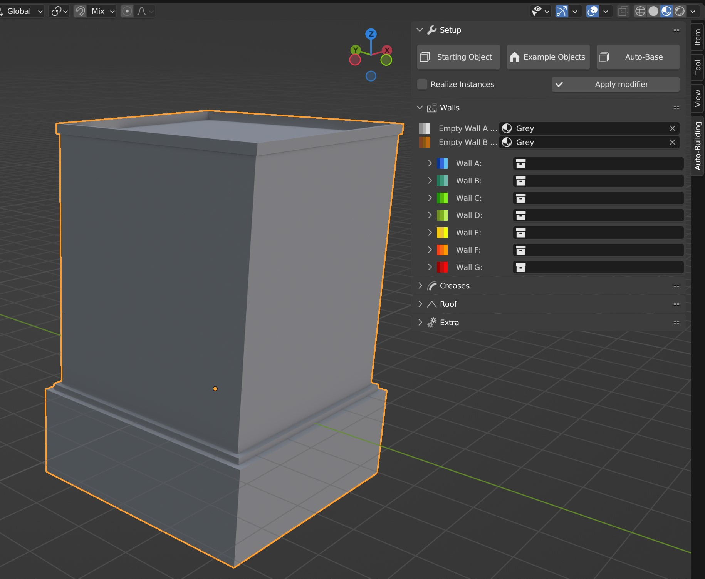
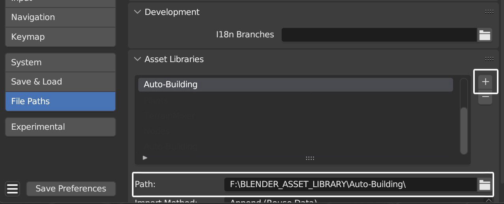
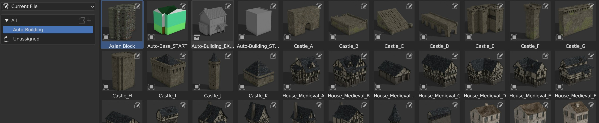

Installation
=====

.. _installation:

Installation
------------

Auto-Building comes with a custom interface to siplify the creation process.
To install it, go to:
**Top menu** -> **Edit** -> **Preferences** -> **Addons** -> **Install**.

Select the **Addon zip file** and make sure the Auto-Building addon is checked.

.. image:: images/Instalation.jpg

Now a new tab called Auto-Building will appear in the viewport right panel (shortcut N)
This tab will show you the Auto-Building Geometry Node of your building whenever you select one.
It will also allow you to create a starting base with a simple template. With the correct Materials setup.

Asset Browser
----------------

The system also come with some building exanples for you to use. They are marked as Asset so you can add the Preset blender file in your own asset browser if you wish to access them easily.

To install them. Simpluy copy the Auto-Build Preset Blend file to your personal library and create a new file path for your asset browser in your Preferences:

