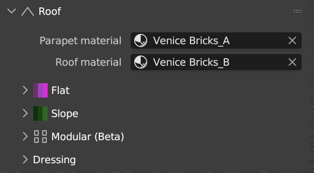

Roofs
============

**Parapet material**: Material to use for the edges of the flat roof.

**Roof material**: Material to use on the flat roof or under the roof tiles.

Flat
------
Flat roof will automatically appear on the flat top surfaces of your object, however you can force it by applying the **ID_RoofFlat**

.. image:: images/RoofFlat.gif

**Height**: Height offset of the roof.
**Parapet height**: Height of the parapet.
**Parapet Thickness**: Thickness of the parapet.

Slope
-------
Apply the ID_RoofSlope to remove the parapet and scatter Rooftiles objects on it.

.. image:: images/RoofCrease.gif

**Roof tile** Collection to use for the roof tiles.

**Crease spacing**: Distance of the tiles on the crease edges.

.. image:: images/RoofGrid.gif

**Coverage**: Scale the roof to be bigger than the original face size.

**Alligned**: If this option is on, will do its best to scatter the tiles on a grid.

**Density X**: Tile Density X

**Density Y**: Tile Density Y

.. image:: images/RoofRandomTransform.gif

**Random transformation**: Add randomness to your tiles position, rotation and scale.

Modular
--------

.. image:: images/RoofModular.gif

The Modular roof system is in beta but can be useful in some case. It works like Lego blocks.
The position of the block in the collection is important. And all the blocks needs to have the same cubic dimension. Please look at the Example objects to see how it works.
Here is the position list:
0 - Center block
1 - Side block
2 - Corner out block
3 - Corner in block

**Density**: Will add more block to cover the roof, resulting in a denser roof.

**Coverage**: Scale the roof surface 

Roof Dressing
-------------

.. image:: images/RoofDressing.gif

**Dressing collection**: Collection of object to use to scatter them on the roof.

**Dressing density**: Density of object to scatter on the roof, the smaller the number the less object .

**Seed**: Randomize scattered object.

**Include Slope**: If you want to keep your objects only on flat roof or include the slopes.

